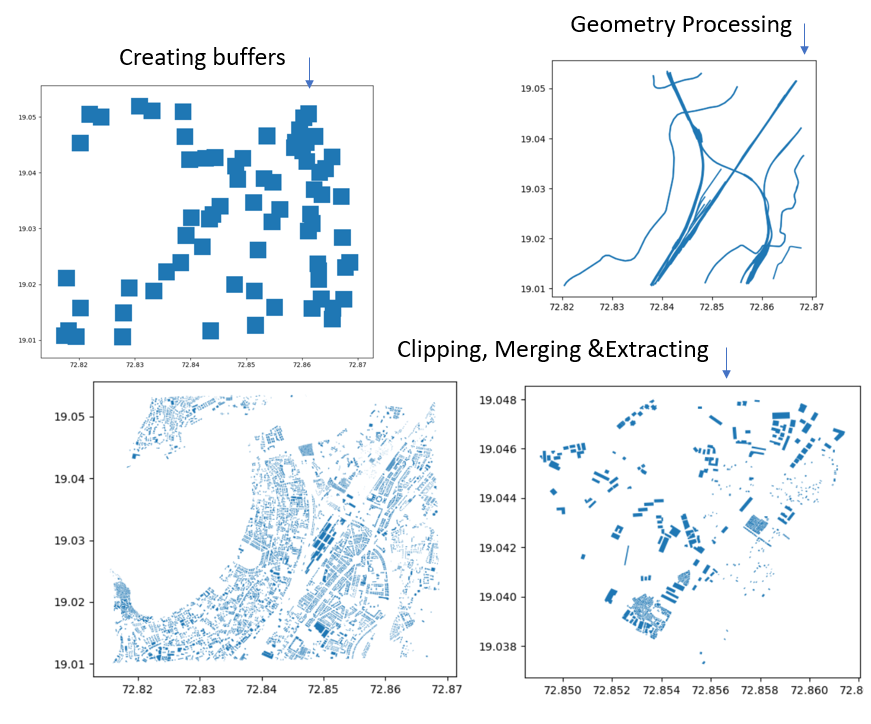
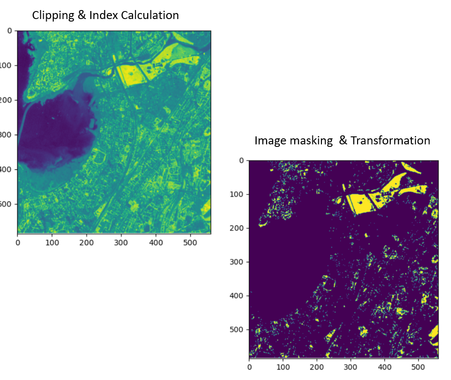
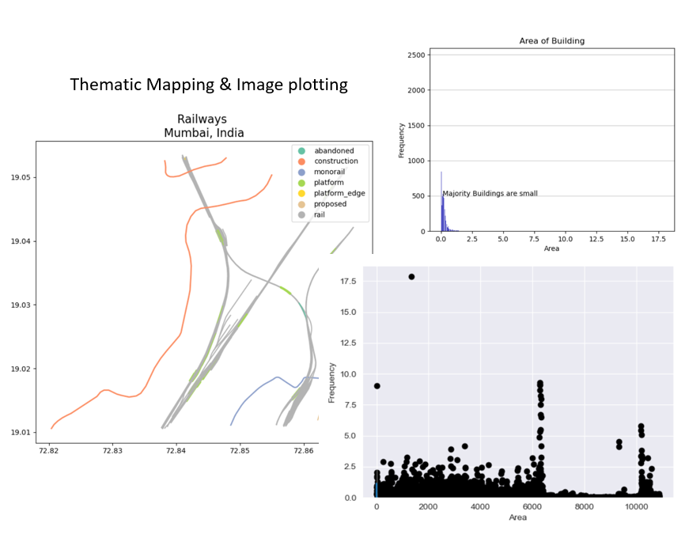
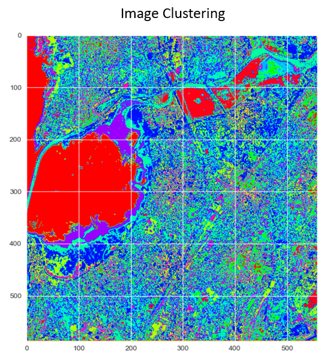

# Contents
  [Course Summary](#course-summary)
  [What you will learn?](#what-you-will-learn-?)
  [Course Structure](#course-structure)
  [Course Assessment](#course-assessment)
 [Course Instructors](#course-instructors)
 [Vector Demo Results of Execercises](#vector-demo-results-of-execercises)
 [Raster Demo Results of Execercises](#raster-demo-results-of-execercises)
 [Visulization Demo Results of Execercises](#visulization-demo-results-of-execercises)
 [Classification Results of Execercises](#classification-demo-results-of-execercises)

# Course Summary

This is a weekend course so that you don't have to worry about your daily schedule or work-frame. Our course instructor will teach you the Python basics needed for the GIS and programming related to the GIS data handling and visualization on weekends (2 weekends) and also provide the assignments regarding the taught concepts for your practice. 
If you have doubts regarding the assignments don't worry we have arranged a counseling lecture for you every Wednesday(Evening/Night session). 

The materials, 

    - You will get all the lectures recorded on our albedo foundation android app so don't worry if you skip the lecture
    - You will get python scripts which were taught during the course work and the guided manual of the course work
    - You will get the solution scripts of the assignments too!
    - The whole course will be a live online class so you can interact with the instructor and feel free to ask your doubts immediately 

The course prerequistes are, 

    - Working knowledge of remote sensing & Geospatial fundamental concepts. 
    - Basic computer knowledge & working computer

# What you will learn?

    - Introduction to basic python programming (Google Colab or Pycharm)
    - Vector data handling and manipulation
    - Raster data handling and manipulation
    - Data Visualization and Styling
    - Functions and Modules in Python
    - Bonus lecture on GEE (Google Earth Engine)
    
# Course Structure

    - This course will be of a total of 30 hours (12 hours course work + 18 hours of hands-on assignments). 
    - There are total 6 pratice tasks and 1 assessment task will be given along with the scripts. 
    - The course work session will be on weekends from 2.30 pm to 4.30 pm and two counseling lectures will be on Wednesday & end of the course (flexible according to the majority of participants choice).

# Course Assessment

In order to qualify for the certificate you need to achive the following:

    1. Get 40% marks in quiz
    2. Submit at least two pratice task
    3. Submit one assessment task

# Course Instructors

Manushi Trivedi : 

LinkedIn: https://www.linkedin.com/in/manushi-trivedi-51295a116/
  Google Scholar: https://scholar.google.com/citations?user=Eu15wTEAAAAJ&hl=en

# Vector Demo Results of Execercises

During the course we teach basics of python coding line by line and its use for gemotery processing like clipping, feature extraction, intersection, merging, re-projecting the shapefile etc. The course also include how to access the metadata of vector data, reading & writing multiple files etc.

# Raster Demo Results of Execercises
In raster processing include reading & writing raster files, image masking, accessing metadata of raster files, image stacking, Index calculation and batch processing etc.

# Visulization Demo Results of Execercises
The visulization part does not only include plotting of spatial data but its attribute data as well. 

# Classification Results of Execercises
The unsupervised classification will be explored in this session.

